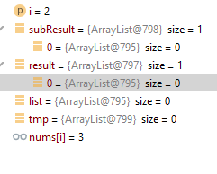

```java
        List<List<Integer>> subResult = subsets(nums, i+1); // =>798 contains sublist with id 795
        List<List<Integer>> result =  new ArrayList<>(subResult); // => 797 (new) but sublist will point to same 795
        for(List<Integer> list: subResult){
            List<Integer> tmp = new ArrayList<>(list); // very important so that tmp is different from
            tmp.add(nums[i]);
            result.add(tmp);
        }
```


- Deque
```java
Deque<Integer> d = new ArrayDeque<>();
d.add(1);
d.add(2);
d.add(3);
d.addFirst(0);
d.addLast(4);
d.addLast(5);
d.remove(); // Removes from Head
d.removeFirst(); // Removes from Head
d.pop(); // Removes from Head
d.poll(); // Removes from Head
d.push(3); // inserts at head
System.out.println("-------");
d.forEach(System.out::println); // 3,4,5
NOTE: Deque doesn't support insert or get at an index
```
- Queue
```java
Queue<Integer> q = new ArrayDeque<>();
q.add(1); // add at the end
q.add(2);
q.add(3);
System.out.println("=========");
System.out.println((q.poll())); // 1
System.out.println("=========");
q.add(4);
q.forEach(System.out::println); // 2, 3,4
```