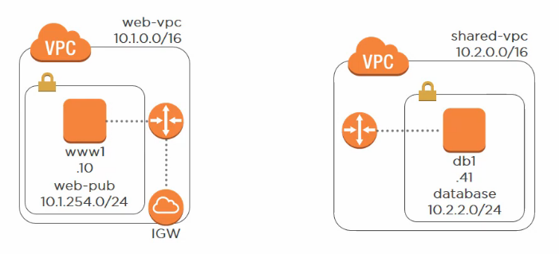
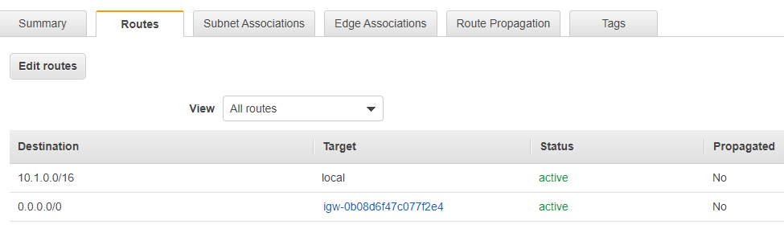
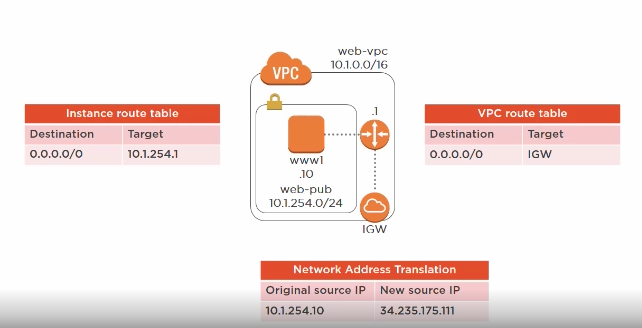
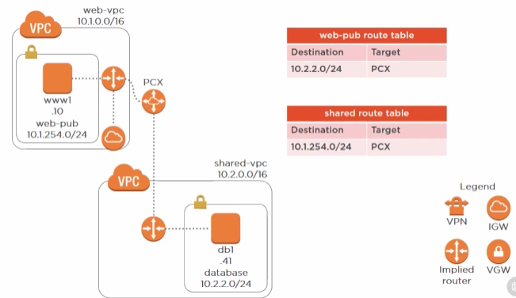
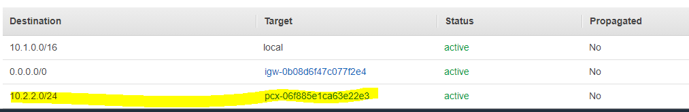
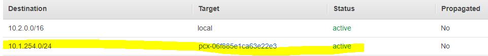
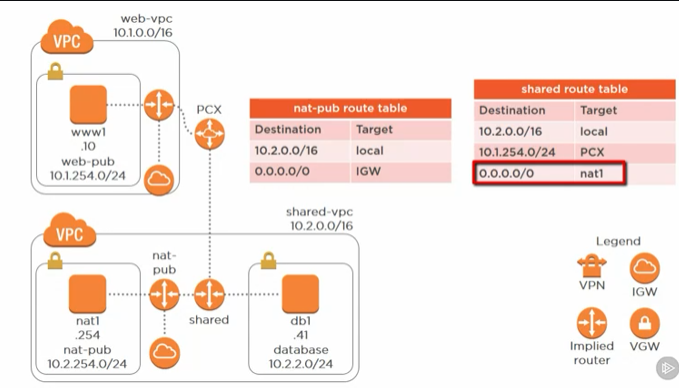

### Creating a Public VPC
1. Create Public VPC - Name: __web-vpc__ (CIDR 10.1.0.0/16)
2. Create a Public Subnet - Name: __web-pub__ (CIDR 10.1.254.0/24. Zone: us-east-1a)
3. Create a __New Route Table__: Name: __web-pub__ (associate it with web-pub subnet)
     - There will be a default Route table created. It will have one route which says any route destined to 10.1.0.0/16 stays in local VPC. The above subnet will, by default, be associated to it. But we will:
     - Create a __New Route Table__: Name: __web-pub__ . 
       - Associate subnet: web-pub (10.1.254.0/24) to this route table, moving it from default association.
       - This new route-table will also have one route like the default one (saying Destination: 10.1.0.0/16 Target: Local VPC)
     - NOTE: Route table = implied router. You can't packet capture between two instances in different VPC. Implied routers will block it.
4. Create an Internet Gatweway (__web-igw__) for enabling internet access. It will be detached when you create it. So, attach it to our __web-vpc__
5. Go to __web-pub__ route table:
     - Go to routes and add a new route with __web_igw__ as the target 
 
 ###Launching EC2 instance: 

6\. Create Security Group (name: __web-pub-sg__) with following inbound rules
  
  | Protocol| Source|
  | ------------- |:-------------:| 
  | ssh (TCP 22)  | Your IP | 
  | HTTP (TCP 80) | 0.0.0.0/0 (anywhere)|
  

7\. Create Elastic Network Interface (ENI) (Services > EC2 > Network interfaces)
   - Name: __www1 eth0__ (subnet: web-pub | Private IP address: __10.1.254.10__ (don't leave it auto assignable) |ecurity group: web-pub-sg) 
   - There will be no public IP assigned yet. 
 8.\ So we will allocate & assign Elastic IP Address (EIP) (Network and security > create and associate with __www1 eth0__ )
 9.\ Launch EC2 instance (from community AMI - ami-1cb6b467. Use web-vpc and web-pub subnet)
  _ Name: __www1__
  - Scroll down to Network interfaces and for eth0, select the network interface we created in step 7
  - Note: when you create EC2 instance in a subnet AWS will not assign public IP automatically
  - security group __web-pub-sg__
 10.\ ssh to the EC2 instance
   - ping 10.1.254.1 (which is the ip that is assigned to implied router) & 8.8.8.8 (google to check internet access)
<pre>
[ec2-user@ip-10-1-254-10 ~]$ route
Kernel IP routing table
Destination     Gateway         Genmask         Flags Metric Ref    Use Iface
default         10.1.254.1      0.0.0.0         UG    0      0        0 eth0 
(<= this is the implied router. 8.8.8.8 is not explicitly defined, so use this route)
10.1.254.0      *               255.255.255.0   U     0      0        0 eth0
169.254.169.254 *               255.255.255.255 UH    0      0        0 eth0
172.17.0.0      *               255.255.0.0     U     0      0        0 docker0

And it route table too there is no explicit route to 8.8.8.8 so it uses the route
thru web-pub-igw (refer pic in step 5)

[ec2-user@ip-10-1-254-10 ~]$ curl ifconfig.co
34.235.175.111 <= Public IP
[ec2-user@ip-10-1-254-10 ~]$ ip a <= does not list the public IP. Therefore, Network Address Translation (NAT) must be kicking in
Whenever a private IP is associated with public Elastic IP, a NAT translation occurs. This is a very scalable solution
</pre>

### Creating a Private VPC (shared VPC)
1. Create Public VPC - Name: __shared-vpc__ (CIDR 10.2.0.0/16)
2. Create a database Subnet - Name: __database__ (CIDR 10.2.2.0/24. Zone: us-east-1a same as web subnet for cost optimization)
3. Create a __New Route Table__: Name: __shared__ (associate it with database subnet)
4. Directly create an EC2 instance: Name : __db1__ (no ENI etc as it's going to be private. However, in the network interface, assign a Primary IP 10.2.2.41)
5. Add a Security Group __database-sg__ (note: no ssh from web-vpc is allowed)

 
 
 ### VPC Peering:
 
 
 
 1. Create Peering Connection (__web-shared__):
     - Requester - web-vpc, Accepter - shared-vpc (can be other way round too. Accepter can also be in different aws ac, and so accepter needs to accept the peering)
     - We now need to accept the peering connection on behalf of shared vpc for web-shared
  2. Modify Route tables 
        - First web-pub & then shared

==

- Now ping 10.2.2.41 will succeed from www1 ssh session

Note: we could have provided 10.1.0.0/16 instead of the subnet 10.1.254.0/24 if we wanted to have a route to all subnets in the web-vpc

- Inter-region peering supports ipv6 since 2019
- You cannot create a VPC peering connection between VPCs with matching or overlapping IPv4 CIDR blocks. [link](https://docs.aws.amazon.com/vpc/latest/peering/invalid-peering-configurations.html)

### Securing Internet Egress using NAT instances 
-  Create NAT Instance > Use NAT instance as a bastion host > Configure database & web server instances

[Read](https://docs.aws.amazon.com/vpc/latest/userguide/VPC_NAT_Instance.html#basics)

1. Create Internet gateway __shared-igw__ > attach to "shared-vpc"
2. Create Subnet __nat-pub__ > associate to shared-vpc > CIDR block 10.2.254.0/24
3. Create Route Table __nat-pub__ w/shared-vpc.
   - Note a route already there (both in this new Route table and the "shared" route we had created earlier):
   - Destination: 10.2.0.0/16 Target: _local_ <= this local is what connects all the routetables (aka implied routers in the vpc)
   - Anyway, add a new route: Destination: 0.0.0.0/0 Target: shared-igw (note: you won't see igw from web-vpc here even though we've vpc peering which is for instanceto instancepeering. It doesn't allow igw's to communicate between VPCs)
   - Associate the subnet _nat-pub_
 4. Create NAT instance
    - Go to Ec2 dashboard > ElasticIPs > allocate New address
    - create EC2 instance __nat1__ (ami-a7fdcadc or vpc-nat) > shared-vpc & nat-pub subnet > Network interfaces (primary IP: __10.2.254.254__). 
    - Security Group viz. __NAT instance__ allowing SSH from my IP & All TCP from VPC and on-prem networks i.e. __10.0.0.0/8, 192.168.0.9/17__
    - Once launched. Go to this EC2 instance > Actions > Networking >  __Change Source/Dest. check > Disable__ 
    - Go to the EIP created at 4a step and assocate it with __nat1__ instance & its private IP
 5. Route table > __shared__ >  Edit Route > Destination: 0.0.0.0/0   Target: __NAT instance__ (Target will show eni-name / instance-id because aws figured out that there is one elastic network interface associated with the instance. Had there been more than 1, aws would have forced us to use the eni as target)
 6. Use __NAT instance__ as a bastion host
    - ssh to NAT1 instance using its EIP i.e. 10-2-254-254
    - ssh from NAT1 instance to db1 i.e. ssh ec2-user@n10.2.2.41 -i MyKeyPair.pem (you will need to copy paste from clipboard, but since we have the security group in 4c allowing ssh only from my IP, it's fine)
    - in db1, curl ifconfig.co => we will get NAT instance's EIP
    - sudo docker run --name db1 -p 3306:3306 -d benpiper/aws-db1
 7. Go to www instance
    - sudo docker run --name www1 -p 80:80 -d benpiper/aws-www1
 8. Browser: http://EIP-of-WWW1 => webpress set up page
    
