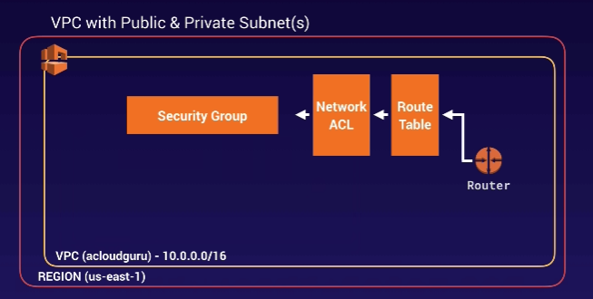
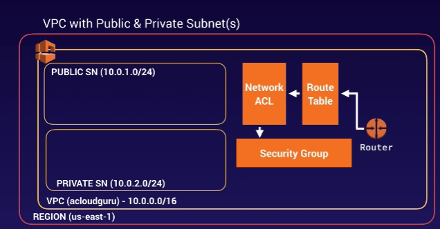
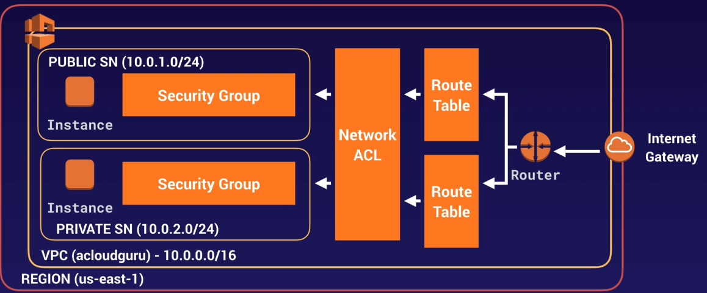
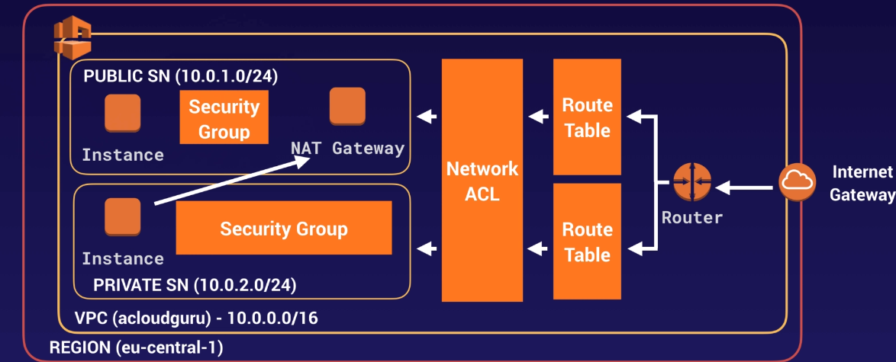

# Ipv4 addressing 101:
- <8 bits>.<8 bits>.<8 bits>.<8 bits>
- Min: 0.0.0.0 | Max; 255.255.255.255
- uses 32 bits. So, 2^32 = 4,294,967,296 address (cf ipv6 128 bits = 2^128 > 40 undecallion..)
- Old way - Classful:
    * Class A: 1st 8 bits given to Network,so 2^24 addresses
    * Class B: 1st 16 bits given to Network,so 2^16 addresses (65526), and so on
- Classless interdomain Routing a.k.a <b>CIDR</b>
    * X.X.X.X/Y where Y is reserved for network
    * 10.10.0.0 / 16 means:
        * 16 for reserved network. Available = 2^16 = 65526
        * Question: How many hosts can we have?
            * 1st set: 10.10.0.0 to 10.10.0.255   = 256
            * 2nd set: 10.10.1.0 to 10.10.1.255   = 256
            * ...
            * 256 set: 10.10.255.0 to 10.10.1.255 = 256
            * Total = 256 * 256 = 65526
        * __This means that with CIDR notation: 10.10.0.0/16 we can have 65536 host__
    * Applying this to VPC in AWS
        * Create VPC with CIDR range 10.10.0.0/16 => 65536 hosts possible
        * We can create subnets in the VPC. 
        * So say 1st subnet has CIDR: 10.10.0.0/24, it means 24 for network, only 8 bits available for host i.e. 256 host addresses starting from 10.10.0.0 to 10.10.0.255
            * And in this case __number of subnets will be 65536 / 256 = 256 subnets__ 
        * Next subnet can then be 10.10.1.0/24 and so on. So each subnet will have 256 hosts
        * We can also reduce the number of hosts in each subnet
            * Say we want only 16 = 2^4 hosts in each subnet. We will reserve 32-4 = 28 for network. So the 1st subnet in this case will be 10.10.1.0/28 (10.10.1.0 to 10.10.1.15). Next will be 10.10.1.16 to 10.10.1.31 and so on.
            * __So in this case we can have 65536 / 16 = 4096 subnets__
    * Private IP ranges:
        * 10.0.0.0   - 10.255.255.255 (10/8 prefix)  => most common in corporate networks
        * 172.16.0.0  - 172.31.255.255 (172.16/12 prefix) 
        * 192.168.0.0 - 192.168.255.255 (192.168/16 prefix)
    * https://cidr.xyz/
    * Largest subnet in aws vpc = /16 (2^16  = 65536 hosts)
    * Smallest subnet in aws vpc = /28 (2^(32-28) = 2^4 = 16 hosts)
    * AWS 1 AZ = 1 subnet
    
 # What resources are created by default when we create a VPC in AWS?
- No subnet and internet gateway created by default. 

 
 - Let's call it __myVPC__
 - When creating [subnet](https://docs.aws.amazon.com/vpc/latest/userguide/VPC_Subnets.html), Amazon randomizes AZ. So us-east-1a in one AWS account may be a totally different AZ in another AWS account
 - Let's create two subnets 10.0.1.0/24 & 10.0.2.0/24 => hosts must be 2^8 = 256 but in actual it's only 251 because AWS reserves first 4 and last one for its own use. (i.e 10.0.1.0, 10.0.1.1, 10.0.1.2, 10.0.1.3 & 10.0.1.255)
 - We will need 1 to be publicly accessible. Let's say 10.0.1.0. So we choose this subnet, go to action and _Enable auto-assign public IPv4 address_. So now we can launch EC2 in this subnet and it will automatically get a public IP
 - Now this is how our VPC look:
 
 
 - Still Missing way to get into this VPC - Internet Gateways (IGW). Go and create one.(__igw_navspeak__) It will be detached. Attach it to the VPC we created. Note that if you create another Internet gateway, you won't be able to attach an already attached VPC (the one you just attached to the previous gateway)
 - 1 IGW per VPC
 - Now if we to Route Table and look at the Main route table, we will see that since the new subnets were not explicitly associated with any route tables, therefore they were associated with this main route table created when the VPC was created. This means that every subnet that we create will, be default, be public.
 - _In order to avoid this, we want to keep our main route table private and separate route table for our public subnet_
 - Create a new Route Table (for public access call it __myPublicRoute__). Edit Route and add Destination 0.0.0.0/0 and target as __igw-navspeak__ (the one you just created). Edit Subnet association and add the subnet you want to make public. Now if you go to main Route table only one subnet (10.0.2.0) will be associated, the other (10.0.1.0) that we associated to the new Route table will be gone. The new route table (_myPublicRoute_) will have route association with the internet gateway we created.
 - Create two EC2 instance - choose myVPC instead of default. For one, choose public subnet (10.0.1.0/24) and it will have a public ip assigned upon launch. For other choose 10.0.2.0 which will have no public ip.
 
 
 
 - Note: on public subnet, the security group is a new one named WebDMZ (note security groups don't span VPC, what we created might have been named WebDMZ but was associated with default VPC, so we could not use that )
 and on private it is a default security group for that VPC
 - We can't SSH to private subnet EC2, even from the EC2 in the same VPC because both have separate security group and security groups do not communicate by default. So we will create a new Security Group say myDBSG and have "All ICMP " open from Source(either security group webDMZ or CIDR range 10.0.1.0/24), HTTP, HTTPs, MySQL/Aurora, SSH
 and associate it with my private EC2. We'll also remove the default security group
 - Now from public EC2 you can ssh to the private one (if you have the private key), but then you still won't be able to run any commands needing internet access like yum update as we are in a private subnet with no route out to the internet
 
 # NAT (Network address translation) Instances & gateways 
 - We want our EC2 instances in the private subnet to go out to the Internet Gateway to download software
 - NAT instances are individual EC2 instances (being phased out though). Prefer NAT gateways which is a highly available gateway that allows you to have your private subnet communicate out to the internet without becoming public
 - NAT instance - EC2 machine from community AMI. Choose myVPC, public subnet, choose myWebDMG SG. It will have public IP.
 - NAT instance => bridge between private subnet thru the public subnet to the internet gateway. So we __need to disable the source & destination checks__
 - So we have now:
 1. WebServer Ec2 instance - public - non default Route Table
 2. DB EC2 instance - private - whose subnet is associated with the main Route table, and has no route out
 3. NAT instance - (must be in public subnet) We will need to associate the Destination (0.0.0.0/0) to target instance (NAT EC2)
 
 - NAT instances are single point of failure. The ammount of traffic that NAT instances can support depends on instance size. If you are bottlenecking, increase instance size. You can create High Availibilty using Autoscaling groups, multiple subnets in different AZs, and a s script to automate failover but too complicated. If that instance goes down, and  you go to the Route table, you will see its status as blackhole. NAT instance are behind a security group. 
 - So, create NAT Gateway and associate it with the public subnet (allocate an elastic IP). Edit route in Main Route table. Choose "Destination: 0.0.0.0/0" and "target" as the NAT Gateway just created
 - NAT Gateways are redundant inside the AZ (only one NAT gateway in an AZ), Preferred. Starts with 5GBps thruput and scales upto ~45 GBps. No need to patch, add to SG.
 - NOTE: NAT gateway can also be single point of afilure. If you have resources in muliple AZ & they share 1 NAT gateway which if goes down causes all resoureces to lose internet access. So, create NAT gateway in eah AZ 7 configureyourrouting to ensure that resources use NAT gateway in the same AZ.
 
 
 
 # Network Access Control Lists vs Security Groups
 
  
 

    
    
            
            
 

     
        
    
     
