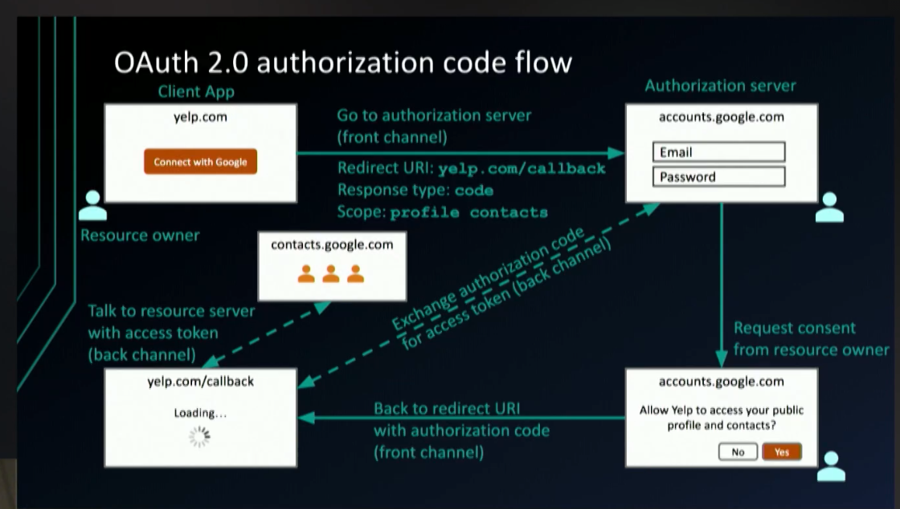
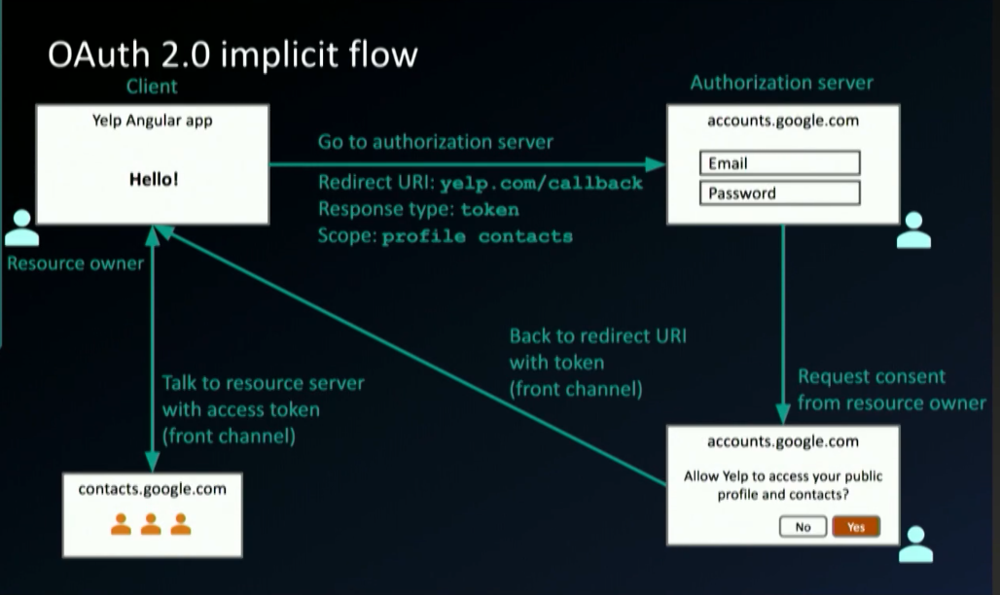
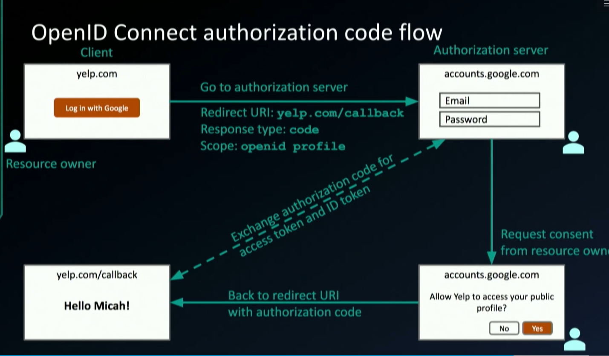

# OAuth 2.0 

## Table of Content
* [Analogy](#Hotel-and-App-Analogy)
* [OAuth 2.0 Code Flow](OAuth-2.0-Code-Flow)
* [OAuth 2.0 Flows](OAuth-2.0-Flows)
* [OAuth 2.0 Implicit Flow](Implicit-Flow)
* [ID Token](ID-Token)


## Hotel and App  Analogy:


| Hotel | App  | Oauth | description |
| --- |--------| -----|-------------|
|Manager|Me, you, end user|Resource Owner|wants client app to do things on its behalf|
|Repair Guy|Yelp|Client App |needs authz to interact with an API on user's behalf|
|Receptionist|Google|Authz Server|grants access in form of tokens to a client app/
|Rooms|Google Contact API|Resource Server|has an API that an app can use if presented with a valid token|

## OAuth 2.0 Code Flow



* Back Channel (highly secure channel) - The solid lines - server to server
* From Channel (less secure channel) - Dotted lines - Passes thru browser 


#### 1. Starting the flow (Authorization Step)
* Front Channel call using GET
<pre>
Request Sent from Yelp to Google                      Google to Yelp on No Consent        On Consent from user
===========================================================================================================
GET https://accounts.google.com/o/oauth2/v2/auth?   |   https://yelp.com/callback?   |     https://yelp.com/callback?           
	client_id=abc123&                               |   error=access_denied&         |      code=oTynkhkl7hk&
	redirect_uri=https://yelp.com/callback&         |    error_description=The user  |        state=foobar
	score=profile contacts &                        |   did not consent              |
	response_type=code&                             |                                |
	state=foobar                                    |                                |
===========================================================================================================
</pre>
- Authz server (google) has to return State field _as-is_, and it is needed for client app to use it to determine when the flow is complete (esp needed for front channel communication as an extra step)
- Consent given. Authz server returns the shortlived *code* that client app will exchange with authz server to get the Bearer token
- Note that the code is very short-lived (about a min or so) lest it be compromised. Plus should it happen, there is a client_secret that Client App (Yelp) has to send (not known to anyone but it)

#### 2. Exchange code for an access token:
* Back channel call using POST to a token endpoint
<pre>
POST www.googleapis/com/outh2/v4/token
Content-Type: application/x-www-form-urlencoded

code=oTynkhkl7hk&
client_id=abc123&
client_secret=secret123&   <== only known to the client App. Unless server is breached, hell hath no fury
grant_type=authorization_code <== synonymous to the flow

Authorization Server returns an access token:
{
	access_token: "fEgkkkjhgkkhj7jkjll",
	expires_in: 3920,
	token_type" "Bearer"
}
</pre>
#### 3. Use the access token

* Back channel call to contact API using GET (do it over HTTPS)
<pre>
GET www.api.google.com/some/endpoint
Authorization: Bearer "fEgkkkjhgkkhj7jkjll"
</pre>

- Note here the Bearer Token never gets to the browser (or passes front channel). So it's safe as long as your back channel is safe (TLS) 
- But in pure Single page apps like Angular that has no backend, we have less choice as we still would need to get token to the angular app - a less secure security posture
- Compared to it's secure to have say a springboot or .NET app behind the SPA app is better flow in terms of security
- There is an *implicit flow* for pure SPA apps - but it's now not needed. There are better flows

## OAuth 2.0 Flows
(usually 3)
* Authz code (front + back channel) - discussed above (Webapp w/ server backend)
* Authz code w/PKCE (front + back channel) - Proof Key for Code Exchange - For Mobile and native apps (libraries available)
* (X) Implicit (front channel only) - !DON'T USE IT - was for SPA apps/Javascript apps. Better options now!
<br>
* (almost very less usage) Resource owner password (back channel only)
  - Almost never applicable for external Authz Servers
  - Password Antipattern prone as you might collect password in your Spring layer and pass it to Authz server (like Okta)
  - Ok for cases when you are the credential store
* Client Credentials (back channel only)
  - No front end. Batch jobs. Microservice and APIs

## Implicit Flow  



* Difference with Code flow:
   - Response_type is token. So the access token is immediately returned to the Client SPA app using Front Channel
   - Was ok till 2007-14 when there was no other choice. Browser features like history syncing (where access token may be synched to a cloud system), extension etc not common. 

## OpenID Connect

* Identity use cases like Simple Login, Single sign on across sites,Mobile app Login were using OAuth 2.0 till say 2012 but were Authentication use cases
* Delegated authz is where OAuth 2.0 should be used
* Problems with using OAuth 2.0 for authn:
  - No std way to get user's info (common endpoint to get info), all impl different, no common set of scopes
  
|OpenID Connect - For Authn|
|:---:|
|OAuth 2.0 - For Authz|
|HTTP|

* What OpenID Connect adds:
  - ID token
  - /userinfo endpoint for getting more user info
  - Standard set of pre-defined scopes for interop (can still have custom scopes)
  - Standardized implementation
 
 
 
 <pre>
 Request Sent from Yelp to Google                      Google to Yelp on No Consent        On Consent from user
 ===========================================================================================================
 GET https://accounts.google.com/o/oauth2/v2/auth?  |  https://yelp.com/callback?    |     https://yelp.com/callback?           
 	client_id=abc123&                               |   error=access_denied&         |      code=oTynkhkl7hk&
 	redirect_uri=https://yelp.com/callback&         |   error_description=The user   |      state=foobar
 	score=openid profile contacts &                 |   did not consent              |
 	response_type=code&                             |                                |
 	state=foobar                                    |                                |
 ===========================================================================================================
 </pre>
 * Note the required score viz. "openid" which is a signal for Authz server to differentiates it from normal "oauth 2.0" flow & return ID token
 * One more difference is that now when code is exchanged it is not only for token but also for <u>ID Token</u>
 
 <pre>
 POST www.googleapis/com/outh2/v4/token
 Content-Type: application/x-www-form-urlencoded
 
 code=oTynkhkl7hk&
 client_id=abc123&
 client_secret=secret123&   
 grant_type=authorization_code 
 
 Authorization Server returns an access token:
 {
 	access_token: "fEgkkkjhgkkhj7jkjll",
 	id_token: "ehhh...." <= New because we had openid scope
 	expires_in: 3920,
 	token_type" "Bearer"
 }
 </pre>
 
 ## ID Token 
 * Has to be JWT -part oidc
 * oauth didn't specify token format. It was thus a double-edged sowrd: Flexible but reduced interop. Now a lot of provider use JWT for token but it doesn't have to be so like for ID token
 
 JWT format:
 ```json
(Header)
.
{
    "iss": "https://accounts.google.com", /* 7 registered claims */
    "sub": "nav@test.com",
    "name": "nav",
    "aud": "s6BhdRkqt3",
    "exp": 1234567890,
    "iat": 123456800,
    "auth_time": 1234567880
}
.
(signature) /* <= to ensure payload is not tampered */
```

* Calling the userinfo endpoint
<pre>
GET www.api.google.com/oauth2/v4/userinfo
Authorization: Bearer "fEgkkkjhgkkhj7jkjll"

200 Ok
Content-Type: application/json
{
   "sub"  : "you@gmail.com"
   "name" : "Nav"
   "profile_picture" : "http://..." 
   "more additional info that is either sensitive or high vol (that can slow down) that you don't want in ID Token"
}
</pre>